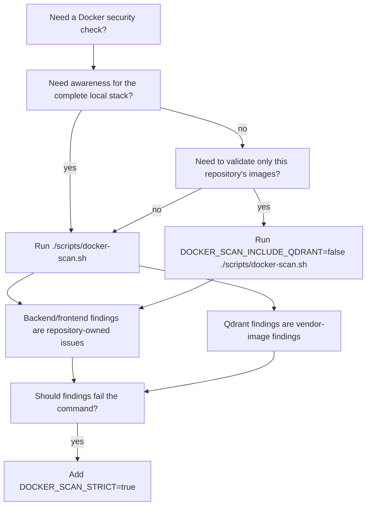

# Local GenAI Lab

[](https://github.com/jrodolfo/local-genai-lab/actions/workflows/ci.yml)


Local-first GenAI lab for building and testing tool-assisted chat workflows.
Not just a chatbot UI.

This project combines a React frontend, a Spring Boot orchestration backend, local and remote model providers, persistent session memory, MCP-backed AWS tooling, and a RAG workspace over the project documentation in one full-stack repository.


## Fastest Path

If you want the shortest path to a running local setup:

```bash
cp .env.example .env
./scripts/start.sh
```

Then open:

- frontend: `http://localhost:5173`
- backend health: `http://localhost:8080/actuator/health`

Notes:

- By default, the backend starts on `http://localhost:8080` with `APP_MODEL_PROVIDER=ollama`.
- If you want Bedrock or Hugging Face available in the provider selector, add their config to `.env` first.
- For the default Ollama path, make sure `llama3:8b` is installed locally.
- The `RAG` workspace is enabled by default and uses the local `docs/` corpus.
- The lifecycle scripts store PID files and logs under `.run/`.
- Use `./scripts/status.sh` or `make status` to inspect the local runtime.

## Why This Matters

Most LLM demos stop at chat. This project explores how to connect models to real systems.

It focuses on:

- tool-assisted chat with backend-side orchestration instead of direct frontend-to-model calls
- provider abstraction with Ollama by default plus Amazon Bedrock and Hugging Face as optional remote provider APIs
- persistent session memory with resume, search, filter, import, and export flows
- MCP-backed local tool execution for AWS audits, reports, and artifact generation
- a separate RAG workspace for asking questions against the local documentation corpus with cited source chunks
- structured report rendering, artifact preview, streaming responses, and API observability

## Architecture

High-level interaction flows:

For the full system-level view, see [docs/architecture.md](./docs/architecture.md).

```text
React -> Spring Boot
          |-> MCP -> Shell Scripts -> AWS CLI -> Report artifacts
          |-> Prompt enrichment with tool result -> Ollama / Bedrock
```

In the successful tool-assisted path, the backend:

1. receives the user message
2. decides a tool is needed
3. calls the MCP-backed tool
4. gets structured tool output back
5. builds an augmented prompt with that tool context
6. sends that enriched prompt to Ollama, Bedrock, or Hugging Face

Primary chat path:

```text
React Frontend -> Spring Boot Backend -> Ollama, Bedrock, or Hugging Face
```

Tool-assisted chat path:

```text
React Frontend -> Spring Boot Backend -> Local MCP Server -> Shell Scripts -> AWS CLI / report artifacts -> Spring Boot Backend prompt enrichment -> Ollama, Bedrock, or Hugging Face
```

RAG path:

```text
React RAG Workspace -> Spring Boot RAG API -> local docs corpus -> chunk retrieval -> Ollama, Bedrock, or Hugging Face -> answer with cited source chunks
```

Immediate backend response path:

```text
React Frontend -> Spring Boot Backend -> clarification or tool-failure response
```

## Project Structure

```text
local-genai-lab/
├── Makefile
├── scripts/
│   ├── start.sh
│   ├── stop.sh
│   ├── restart.sh
│   ├── status.sh
│   ├── build.sh
│   ├── docker-start.sh
│   ├── docker-stop.sh
│   ├── docker-restart.sh
│   ├── docker-status.sh
│   ├── docker-check.sh
│   ├── docker-verify.sh
│   ├── docker-scan.sh
│   ├── docker-full-check.sh
│   └── README.md
├── ops/
│   ├── lib/
│   ├── tests/
│   └── README.md
├── backend/
│   ├── src/
│   ├── pom.xml
│   └── README.md
├── frontend/
│   ├── src/
│   ├── package.json
│   └── README.md
├── agents/
│   ├── reports/
│   ├── tests/
│   ├── dependency-freshness.sh
│   ├── Makefile
│   └── README.md
├── mcp/
│   ├── src/
│   ├── package.json
│   └── README.md
├── docker-compose.yml
└── README.md
```

Script separation:

- `scripts/` contains human-facing app lifecycle commands, including host-run commands and full Docker Compose commands
- `ops/` contains internal local runtime helpers such as backend-only startup and stack smoke checks
- `agents/` contains MCP/tool-facing shell scripts, report generators, and their shell tests

Docker note:

- the backend Docker image intentionally includes the built MCP server, Node 20.12+, the MCP tool scripts, and empty report directories
- this keeps Docker mode aligned with host-run mode and allows `/actuator/health` to validate MCP and storage paths correctly
- generated report artifacts are not copied into the image; Docker starts with empty report directories

## Prerequisites

- Java 21. The backend build enforces Java 21; confirm with `java -version` before building or running backend tests.
- Maven 3.9+. The backend build enforces this minimum Maven version.
- Node 20.12+
- Ollama installed locally for the default provider
- Docker + Docker Compose, optional
- AWS CLI v2 + `jq` + valid AWS credentials, only for AWS shell tools and local MCP-backed report flows

## Quick Start

### 1. Pull a local model

```bash
ollama pull llama3:8b
ollama run llama3:8b
```

Ollama should be reachable at `http://localhost:11434`.

### 2. Optional: create a local environment file

```bash
cp .env.example .env
```

Fill in only the providers you want available in the running backend process. The backend helper script will auto-load `.env` if it exists.

### 3. Start the app

```bash
./scripts/start.sh
```

This starts both:

- the Spring Boot backend
- the Vite frontend dev server

If you want Bedrock or Hugging Face as the default backend provider instead of Ollama, set `APP_MODEL_PROVIDER=bedrock` or `APP_MODEL_PROVIDER=huggingface` in `.env` or the shell before starting the app. Provider configuration details live in [docs/providers.md](./docs/providers.md).

If port `8080` is already in use, choose another backend port explicitly:

```bash
SERVER_PORT=8081 ./scripts/start.sh
```

The frontend dev proxy follows that override automatically when you start the app this way.

Backend URLs:

- API root: `http://localhost:8080`
- OpenAPI: `http://localhost:8080/v3/api-docs`
- Swagger UI: `http://localhost:8080/swagger-ui/index.html`
- Health: `http://localhost:8080/actuator/health`
- Info: `http://localhost:8080/actuator/info`

`GET /actuator` redirects to `/actuator/health`. Swagger excludes `/actuator/**` so the generated API docs stay focused on the application API.

### 4. Stop, restart, or inspect the app

```bash
./scripts/stop.sh
./scripts/restart.sh
./scripts/status.sh
```

`./scripts/stop.sh` stops processes managed by this repo's PID files. `./scripts/restart.sh`
uses `./scripts/stop.sh --all`, so it also clears processes occupying the configured
backend and frontend ports before starting the app again.

If you want to build generated artifacts before restarting, run:

```bash
./scripts/build.sh
./scripts/restart.sh
```

`./scripts/build.sh` builds the backend package, frontend production build, and MCP
server build without starting or stopping the app. Use `./scripts/build.sh --skip-tests`
for a faster local build when you have already run tests.

Expected build output includes Maven and npm progress plus any JVM/native-access
warnings emitted by Java dependencies during tests. Application/controller stack
traces from expected negative-path tests should not appear in normal build
output. If they do, treat that as test-log noise to investigate rather than as
an expected part of the build.

## Verification Commands

Use these commands depending on what you need to verify:

| Command | Use when | Requires running app? |
| --- | --- | --- |
| `make start` | Start backend and frontend in the background. | No |
| `make stop` | Stop managed backend/frontend processes. | Useful when running |
| `make restart` | Stop then start the local app. | No |
| `make status` / `./scripts/status.sh` | Inspect local processes, health URLs, RAG mode, Ollama readiness, and Qdrant readiness. | Useful when running |
| `make build` | Build backend, frontend, and MCP artifacts without changing the running app. | No |
| `make check-app` | Smoke-check the live backend/frontend stack after startup. | Yes |
| `make docker-start` | Start backend, frontend, and Qdrant with Docker Compose. | No |
| `make docker-stop` | Stop the Docker Compose stack. | Useful when running |
| `make docker-restart` | Restart the Docker Compose stack. | No |
| `make docker-status` | Show Docker Compose service status and expected URLs. | Useful when running |
| `make docker-check` | Smoke-check the running Docker Compose stack. | Yes |
| `make docker-verify` | Restart, inspect, and smoke-check Docker mode. | No |
| `make docker-scan` | Scan Docker images for known vulnerabilities. | No, but images should exist |
| `make docker-full-check` | Run Docker verification and Docker image scan. | No |
| `make dependency-freshness` | Report Maven, npm, and Docker dependency freshness without modifying files. | No |
| `make release-check` | Run the local pre-release validation gate. | No |
| `make clean-ds-store` | Remove local macOS `.DS_Store` files from the repo tree. | No |
| `make test` | Normal local pre-commit suite for ops, backend, and frontend tests. | No |
| `make verify` | Broader CI-aligned verification, including frontend build, MCP tests/build, and MCP tool script lint/tests. | No |
| `make test-rag-qdrant-smoke` | Verify the live Ollama embeddings plus Qdrant RAG path. | Yes, in Qdrant vector mode |

Use `make test` when you only need normal verification. Use `make verify`
before larger pushes or broad changes. Use `make build` or `./scripts/build.sh` when
you also want fresh generated backend, frontend, and MCP artifacts before
restarting the local app.

Use `make dependency-freshness` as a maintenance radar. It reports Maven
parent/dependency/plugin updates, npm outdated packages for `frontend/` and
`mcp/`, Docker image references, and moving Docker tags such as `latest`. It is
report-only and does not upgrade or rewrite dependency files.

Use `make release-check` when you want one local gate before wrapping a larger
batch of work. It runs tests, broader verification, dependency freshness, and
`git diff --check`. Docker verification and image scanning are opt-in:

```bash
RELEASE_CHECK_DOCKER=true make release-check
```

For the full testing matrix, see [docs/testing.md](./docs/testing.md).

The frontend provider and model selectors now load from the backend's `/api/models` endpoint. You can switch between supported providers at runtime without restarting the backend. For Ollama, the UI only offers locally installed models. If no local models are installed, the UI shows a clear pull hint instead of failing only after submit.

The provider selector only shows providers configured in the running backend process. The provider status banner is cached briefly to avoid excessive live checks, shows `Last checked`, and includes a manual `Refresh status` action when you want to re-fetch the current status explicitly.

For tool-assisted streaming chat, the UI now shows explicit tool lifecycle phases while the request is in flight. Completed assistant replies also show compact tool provenance, and generated summaries, reports, and file lists can be inspected through the artifact inspector panel.

The separate `RAG` workspace is enabled by default. It queries a fixed local corpus rooted at `docs/` and returns answers with cited source chunks. If you want to hide it, start the backend with `RAG_ENABLED=false`.

Lexical retrieval remains the default. The RAG question form can select
`Lexical`, `Vector - In Memory`, or `Vector - Qdrant` per question. Vector
retrieval embeds the same docs corpus with `RAG_EMBEDDING_PROVIDER=ollama` and
`RAG_EMBEDDING_MODEL=nomic-embed-text`; `RAG_RETRIEVAL_MODE` and
`RAG_VECTOR_STORE` still define the backend default target at startup.

Evaluation-only RAG docs are excluded from the indexed corpus by default so
manual test prompts do not become misleading retrieval sources.

The RAG index is built automatically on the first question. You do not need to
click `Rebuild Index` before normal first use. Use `Rebuild Index` after
changing docs, switching retrieval settings, or troubleshooting stale results.

For a plain-language explanation of RAG page terms such as `Index`, `Rebuild
Index`, `Sources`, and `Technical Details`, see
[docs/rag-troubleshooting.md#rag-page-mental-model](./docs/rag-troubleshooting.md#rag-page-mental-model).

If RAG or vector retrieval does not behave as expected, run `./scripts/status.sh` first.
It reports RAG mode, Ollama readiness, whether the configured embedding model is
installed, and Qdrant reachability plus collection point count when the
`Vector - Qdrant` comparison target is available. Common fixes and the RAG
answer `Technical Details` fields are documented in
[docs/rag-troubleshooting.md](./docs/rag-troubleshooting.md).

Good first RAG test prompts:

- `How does provider selection work?`
- `Why is MCP separate from the backend?`
- `How are sessions persisted?`
- `What ADR explains the Mermaid architecture diagram?`

### 5. Optional: build the local MCP server

```bash
cd mcp
npm install
npm run build
```

MCP is enabled by default in the backend. To run without it, set `MCP_ENABLED=false`.

## Docker

Keep Ollama running on the host first, then use the Docker lifecycle wrappers:

```bash
./scripts/docker-restart.sh
./scripts/docker-status.sh
./scripts/docker-check.sh
./scripts/docker-stop.sh
```

For the functional Docker verification workflow, use:

```bash
./scripts/docker-verify.sh
```

This script is not read-only. It stops host-run backend/frontend processes,
restarts the Docker Compose stack, prints Docker status, and runs the Docker
smoke check.

For the broadest Docker check, including the advisory security scan, use:

```bash
./scripts/docker-full-check.sh
```

This runs `./scripts/docker-verify.sh` first and then `./scripts/docker-scan.sh`.

Equivalent Make targets are available:

```bash
make docker-restart
make docker-status
make docker-check
make docker-stop
make docker-verify
make docker-scan
make docker-full-check
make release-check
```

The direct Compose command also works:

```bash
docker compose up --build
```

- frontend: `http://localhost:3000`
- backend: `http://localhost:8080`
- qdrant: `http://localhost:6333`

Docker backend containers reach host Ollama through
`http://host.docker.internal:11434` by default. If your Docker runtime needs a
different address, set `DOCKER_OLLAMA_BASE_URL`; keep host-run
`OLLAMA_BASE_URL` separate because `localhost` inside a container means the
container itself.

The existing `./scripts/start.sh`, `./scripts/stop.sh`, `./scripts/restart.sh`, and `./scripts/status.sh`
scripts run the backend and frontend directly on the host. The `docker-*`
scripts run the full Docker Compose stack. Keep those workflows separate to
avoid accidentally mixing host-run processes with containerized services.

Use `./scripts/docker-status.sh` when you want to know what is running and where to
look. It is diagnostic and prints Compose status, readiness, URLs, log commands,
port checks, and recovery hints.

Use `./scripts/docker-check.sh` when you want to know whether the Docker app is usable
enough to trust. It is a read-only smoke check and exits non-zero if backend
health, frontend, Qdrant, `/api/models`, or `/api/rag/status` is unavailable.
After `./scripts/docker-start.sh` or `./scripts/docker-restart.sh`, run `./scripts/docker-check.sh`
before demos or manual testing.

Use `./scripts/docker-scan.sh` after Docker images have been built when you want to
inspect known vulnerabilities in the backend, frontend, and Qdrant images. It
uses Trivy and runs in advisory mode by default, reporting `HIGH` and
`CRITICAL` findings without failing the command.

Docker security posture:

| Scope | Command | What It Proves | How To Interpret Findings |
| --- | --- | --- | --- |
| Full local Docker stack | `./scripts/docker-scan.sh` | Backend, frontend, and Qdrant images were scanned. | Use for awareness across everything Docker Compose runs. Qdrant findings belong to the external vendor image. |
| Repository-owned images only | `DOCKER_SCAN_INCLUDE_QDRANT=false ./scripts/docker-scan.sh` | Backend and frontend images built from this codebase were scanned. | Use this before declaring this repository's Docker images clean. |
| Strict selected scope | `DOCKER_SCAN_STRICT=true ./scripts/docker-scan.sh` | The selected scan scope has no configured-severity findings. | Use only when the chosen scope is expected to be clean. |



To make findings fail the command, run:

```bash
DOCKER_SCAN_STRICT=true ./scripts/docker-scan.sh
```

The backend and frontend images are owned by this repository. The Qdrant image
is an external vendor image used by Docker Compose. If you want to focus only
on the images built from this codebase, skip the external Qdrant scan:

```bash
DOCKER_SCAN_INCLUDE_QDRANT=false ./scripts/docker-scan.sh
```

Install Trivy first if needed:

```bash
brew install trivy
```

Use `./scripts/docker-full-check.sh` when you want one command that does both: functional
Docker verification plus the Docker image vulnerability scan.

If Docker startup fails, run `./scripts/docker-status.sh` first. It prints the Compose
service table, HTTP readiness checks, expected URLs, service-specific log
commands, and port-conflict checks for `8080`, `3000`, and `6333`. If a port is
owned by the host-run app, run `./scripts/stop.sh --all`; if another app owns the port,
stop that app normally or use the printed PID with `kill <pid>`.

Qdrant is available as an optional local service for the phase-2 RAG vector
database path. It is not required for default startup, lexical RAG, or current
in-memory vector retrieval. Because the RAG UI can compare against
`Vector - Qdrant`, `./scripts/start.sh` and `./scripts/restart.sh` try to start the `qdrant` Docker
Compose service by default when RAG is enabled.

If Docker is unavailable during normal lexical startup, the app still starts and
the `Vector - Qdrant` comparison target remains unavailable until Qdrant is
running. If the backend is explicitly configured with
`RAG_RETRIEVAL_MODE=vector RAG_VECTOR_STORE=qdrant`, Qdrant becomes a hard
startup dependency.

To disable best-effort Qdrant startup:

```bash
RAG_QDRANT_AUTO_START=false ./scripts/start.sh
```

To make Qdrant the active backend vector store:

```bash
RAG_RETRIEVAL_MODE=vector RAG_VECTOR_STORE=qdrant ./scripts/restart.sh
./scripts/status.sh
```

To verify the full live Qdrant RAG path after startup:

```bash
make test-rag-qdrant-smoke
```

This optional smoke test rebuilds the RAG index, confirms the Qdrant collection
has points, submits one RAG question through `vector:qdrant`, and verifies that
the answer includes cited sources. It is intentionally separate from `make test`
and CI because it depends on a running backend, Docker/Qdrant, Ollama, and the
configured embedding model.

Qdrant readiness and collection point count are visible in status output and
the RAG UI. The first RAG question can build the configured index automatically.
Use `Rebuild Index` when you want to populate the Qdrant collection before
asking, or after changing docs, retrieval mode, embedding model, or vector
store settings. To inspect Qdrant directly through the browser or `curl`, see
[docs/rag-qdrant-inspection.md](./docs/rag-qdrant-inspection.md).

## Configuration Overview

The most important backend settings are:

- `APP_MODEL_PROVIDER` default: `ollama`
- `OLLAMA_DEFAULT_MODEL` default: `llama3:8b`
- `BEDROCK_REGION` default: `us-east-2`
- `BEDROCK_MODEL_ID` default: empty
- `HUGGINGFACE_BASE_URL` default: `https://router.huggingface.co/v1/chat/completions`
- `HUGGINGFACE_DEFAULT_MODEL` default: empty
- `HUGGINGFACE_MODELS` default: empty
- `MCP_ENABLED` default: `true`
- `RAG_ENABLED` default: `true`
- `RAG_CORPUS_ROOT` default: `docs`
- `RAG_TOP_K` default: `4`
- `RAG_RETRIEVAL_MODE` default: `lexical`
- `RAG_VECTOR_STORE` default: `in-memory`
- `RAG_QDRANT_URL` default: `http://localhost:6333`
- `RAG_QDRANT_COLLECTION` default: `local_genai_lab_docs`
- `RAG_EMBEDDING_PROVIDER` default: `ollama`
- `RAG_EMBEDDING_MODEL` default: `nomic-embed-text`
- `RAG_EXCLUDED_SOURCE_PATHS` default: `rag-evaluation-guide.md,rag-retrieval-evaluation-template.md`
- `APP_TOOLS_ROUTING_MODE` default: `hybrid`
- `APP_STORAGE_SESSIONS_DIRECTORY` default: `data/sessions`
- `APP_STORAGE_REPORTS_DIRECTORY` default: `agents/reports`

The storage defaults are resolved from the project root so they stay stable whether the backend starts from `backend/` or the repository root.
You can also point `APP_STORAGE_REPORTS_DIRECTORY` to an absolute path outside the repository if you want report artifacts stored elsewhere.
Provider switching details and helper startup scripts live in [docs/providers.md](./docs/providers.md).

## Main Features

### Chat and Providers

- normal and streaming chat endpoints
- Ollama as the default provider
- Amazon Bedrock as an optional remote provider API
- Hugging Face as an optional remote provider API with a configured candidate list that the backend validates dynamically
- provider metadata in responses and saved session history
- typed JSON SSE events for streaming chat
- provider-aware model discovery for the frontend selector
- runtime provider switching across providers configured in the current backend process

Observed model behavior:

- successful tool execution still flows through the selected model by design
- the backend enriches the prompt with grounded tool output instead of bypassing the model
- different models may still phrase the final answer differently after receiving the same tool context
- that variance is intentional in this lab because it helps compare model behavior under grounded prompts

### Sessions

- local JSON-backed conversation memory
- generated session titles and summaries
- session sidebar with search and filters
- JSON and Markdown export
- JSON import with collision-safe session ids
- backend-managed opaque session ids with strict validation
- separate chat and RAG session modes so RAG answers and citations can be reopened without rerunning retrieval

### RAG Workspace

- enabled by default with `RAG_ENABLED=true`
- isolated from the normal chat, MCP, and tool-routing flow
- fixed local corpus rooted at `docs/`
- evaluation-only RAG docs are excluded from indexing by default
- in-memory lexical retrieval by default behind a replaceable backend abstraction
- lexical retrieval is intentional as a zero-dependency baseline; see [docs/rag-evaluation-guide.md](./docs/rag-evaluation-guide.md) for the lexical vs vector comparison
- in-memory vector retrieval is available with `RAG_RETRIEVAL_MODE=vector RAG_VECTOR_STORE=in-memory`
- Qdrant-backed vector retrieval is available with `RAG_RETRIEVAL_MODE=vector RAG_VECTOR_STORE=qdrant`
- repeatable lexical vs vector observations can be recorded with [docs/rag-retrieval-evaluation-template.md](./docs/rag-retrieval-evaluation-template.md)
- RAG readiness and common vector-mode fixes are documented in [docs/rag-troubleshooting.md](./docs/rag-troubleshooting.md)
- phase-2 vector retrieval design notes, including the implemented opt-in Qdrant path, are documented in [docs/rag-phase-2-vector-retrieval-design.md](./docs/rag-phase-2-vector-retrieval-design.md)
- the RAG status card reports both retrieval mode (`Lexical`) and store (`In-memory`)
- each RAG answer can show compact technical details for retrieval target, top K, embedding metadata, and backend timing
- answers generated by the selected provider and returned with cited source chunks
- RAG conversations persist as local JSON sessions with saved answers and citations
- no uploads or agent routing in the current RAG workspace

### Tools and Artifacts

- local MCP-backed AWS audit and reporting flows
- LLM-assisted tool routing with fallback
- multi-turn clarification for missing tool inputs
- structured report cards in the UI
- read-only artifact preview and file listing under `agents/reports/`

Artifact API note:

- the configured reports directory may be inside or outside the repository
- artifact endpoints accept only paths relative to that configured reports directory
- absolute artifact paths are rejected intentionally so the backend keeps a strict read-only boundary

## Command Folders

Human-facing lifecycle commands live under [`scripts/`](./scripts). The root
`Makefile` calls those scripts, so either style is valid:

```bash
make help
make test
make verify
make check-app
make dependency-freshness
./scripts/status.sh
./scripts/docker-check.sh
```

Agent/tool shell tooling lives under [`agents/`](./agents):

```bash
cd agents
make help
make test
make audit
make s3-cloudwatch BUCKET=example.com
```

## Documentation Map

- [docs/architecture.md](./docs/architecture.md): system overview, request flows, provider architecture, tool orchestration, storage, and design decisions
- [docs/documentation-review-checklist.md](./docs/documentation-review-checklist.md): repeatable checklist for catching documentation drift
- [docs/release-checklist.md](./docs/release-checklist.md): local release and dependency freshness checklist
- [docs/rag-evaluation-guide.md](./docs/rag-evaluation-guide.md): manual evaluation guide for the RAG workspace
- [docs/rag-retrieval-evaluation-template.md](./docs/rag-retrieval-evaluation-template.md): template for recording lexical vs vector retrieval comparisons
- [docs/rag-troubleshooting.md](./docs/rag-troubleshooting.md): RAG operational checks, Ollama readiness, vector-mode fixes, and lexical fallback guidance
- [docs/rag-phase-2-vector-retrieval-design.md](./docs/rag-phase-2-vector-retrieval-design.md): design and implementation note for lexical, in-memory vector, and opt-in Qdrant-backed retrieval
- [docs/rag-phase-2-qdrant-implementation-checklist.md](./docs/rag-phase-2-qdrant-implementation-checklist.md): implementation checklist for the smallest opt-in Qdrant RAG slice
- [docs/rag-qdrant-inspection.md](./docs/rag-qdrant-inspection.md): browser and `curl` workflow for inspecting the local Qdrant collection
- [docs/architecture-walkthrough.md](./docs/architecture-walkthrough.md): concise walkthrough of the system design, tradeoffs, and common design questions
- [docs/adr/](./docs/adr/): accepted architecture decision records, including the phase-2 RAG vector retrieval direction
- [docs/testing.md](./docs/testing.md): automated suites, manual smoke tests, and current non-automated areas
- [docs/troubleshooting.md](./docs/troubleshooting.md): common local runtime problems and practical fixes
- [scripts/README.md](./scripts/README.md): human-facing lifecycle, build, and Docker commands
- [backend/README.md](./backend/README.md): backend API, provider config, MCP integration, Actuator, sessions, Bedrock notes
- [frontend/README.md](./frontend/README.md): frontend-specific details
- [ops/README.md](./ops/README.md): local runtime helpers and lifecycle support files
- [agents/README.md](./agents/README.md): shell tooling, report formats, smoke checks
- [mcp/README.md](./mcp/README.md): local MCP server details
- [docs/providers.md](./docs/providers.md): switching between Ollama, Bedrock, and Hugging Face

## Current Scope

- single-user, local-first GenAI lab for hands-on learning and AWS Generative AI Developer Professional exam preparation
- optimized for correctness, inspectability, and local workflow clarity rather than multi-user scale
- intended to run on a developer machine with local Ollama, optional Bedrock access, and optional MCP-backed AWS tooling

## Known Limitations

- not designed as a multi-tenant or internet-facing production service
- MCP tool execution currently uses short-lived local subprocesses, which is acceptable for this local lab but not tuned for shared high-concurrency use
- backend health/readiness is backend-only; whole-stack local checks belong to `ops/check-app.sh`
- artifact access is intentionally read-only and bounded to the configured reports directory
- Bedrock and AWS tool flows depend on your local AWS credentials and runtime environment being configured correctly
- some operational choices favor simple local behavior over production-style resilience, especially around local process orchestration and developer-machine assumptions

## Notes for Heavier Models

- `codellama:70b` is optional and not the recommended first-run default
- larger local models can be much slower and more memory intensive
- if you use a heavier model, you may need to raise backend read timeouts

## Contact

- Software Developer: Rod Oliveira
- GitHub: https://github.com/jrodolfo
- Webpage: https://jrodolfo.net

## License

- MIT License
- Copyright (c) 2026 Rod Oliveira
- See [LICENSE](./LICENSE)
