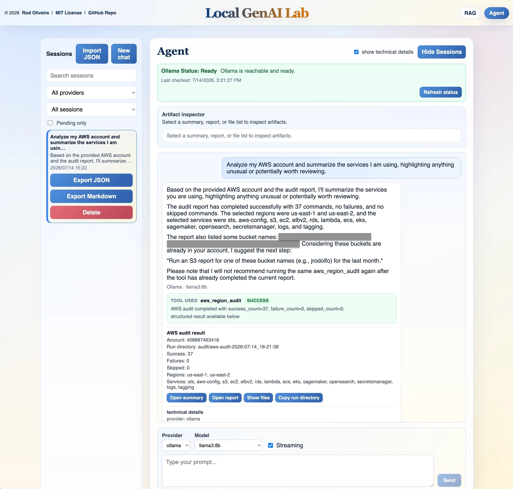
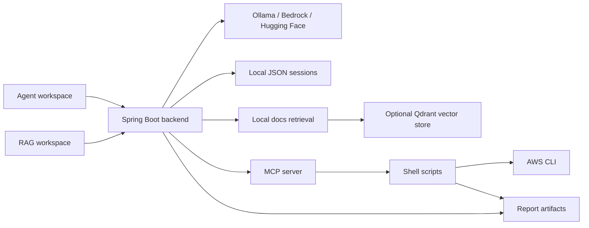
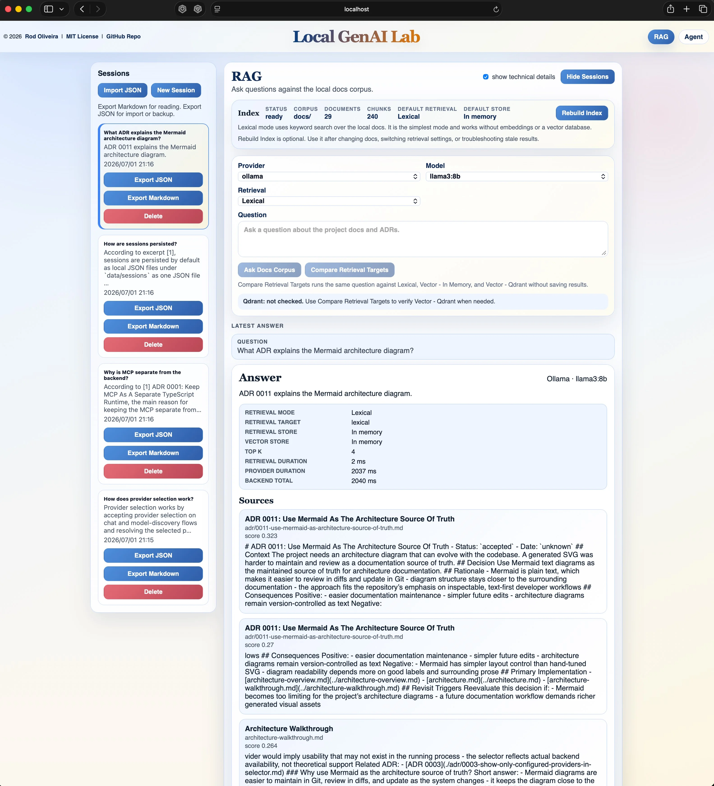

# Local GenAI Lab

[](https://github.com/jrodolfo/local-genai-lab/actions/workflows/ci.yml)
[](https://github.com/jrodolfo/local-genai-lab/blob/main/LICENSE)


Local-first GenAI lab for building and testing tool-assisted AI workflows.

This project goes beyond a chatbot interface by combining a React frontend, a Spring Boot orchestration backend, local and remote model providers, persistent session memory, MCP-backed AWS tooling, and a RAG workspace over the project documentation.

[](./docs/images/local-genai-lab-agent.webp)

## Fastest Path

For the shortest path to a running local setup:

```bash
cp .env.example .env
./scripts/start.sh
```

Confirm the local environment file is ignored before adding provider tokens:

```bash
git check-ignore -v .env
```

Then open:

- frontend: `http://localhost:5173`
- backend health: `http://localhost:8080/actuator/health`

The default provider is Ollama. For a first local run, install Ollama and pull
the default model:

```bash
ollama pull llama3:8b
```

Use `./scripts/status.sh` or `make status` to inspect the local runtime. PID
files and logs are written under `.run/`.

## Why This Matters

Most LLM demos stop at chat. This project explores how to connect models to real
systems while keeping the workflow inspectable on a developer machine.

It demonstrates:

- backend-side orchestration instead of direct frontend-to-model calls
- Ollama as the local default, with optional Bedrock and Hugging Face provider APIs
- persistent local sessions with search, filters, import, and export
- MCP-backed local tool execution for AWS audits, reports, and artifacts
- a separate RAG workspace for questions over the local documentation corpus
- streaming responses, structured report rendering, and API observability

## Architecture at a Glance

The frontend has two distinct workspaces: Agent and RAG. They share provider
selection and local session storage, but they do not share request
orchestration. Agent requests may invoke MCP-backed tools. RAG requests query
the local documentation corpus and return cited source chunks.



For the full architecture, request flows, storage model, and design tradeoffs,
see [docs/architecture.md](./docs/architecture.md) and
[docs/architecture-overview.md](./docs/architecture-overview.md).

## Main Capabilities

- Agent workspace for normal chat, streaming chat, tool-assisted prompts,
  provider selection, sessions, exports, and artifact inspection.
- Provider abstraction across Ollama, Amazon Bedrock, and Hugging Face, with
  provider metadata returned in API responses and saved in session history.
- MCP-backed tool routing for local AWS audit and reporting workflows.
- Structured report cards and read-only artifact previews under the configured
  reports directory.
- Local JSON-backed session storage for chat and RAG conversations.
- RAG workspace for asking questions against the repository documentation with
  cited source chunks and saved RAG sessions.

## Example Agent Prompts

The Agent workspace can route natural-language AWS questions to local MCP-backed
tools when AWS credentials and tool prerequisites are available.

Examples:

- `Analyze my AWS account and summarize the services I am using, highlighting anything unusual or potentially worth reviewing.`
- `Analyze my AWS account and generate a summary report of the resources and services currently in use.`
- `List my S3 buckets.`
- `Run an S3 report for <bucket-name> for the last month.`

For the scripts behind these prompts and more examples, see
[agents/README.md](./agents/README.md).

## Example RAG Prompts

The RAG workspace answers questions against the local `docs/` corpus with cited
source chunks. It does not run Agent tools or MCP-backed scripts.

Examples:

- `How do I run the project locally?`
- `What is the difference between the Agent workspace and the RAG workspace?`
- `How does RAG retrieval work in this project?`
- `When should I use lexical retrieval versus vector retrieval?`
- `How do I troubleshoot Qdrant-backed RAG?`
- `What release checks should I run before publishing a release?`

Try the same prompt with `Lexical`, `Vector - In Memory`, and
`Vector - Qdrant` to compare retrieved sources and answer quality.

## RAG Workspace

The RAG workspace is isolated from the normal Agent flow. It does not invoke MCP
tools or agent routing. It loads the local `docs/` corpus, retrieves relevant
chunks, and asks the selected provider to answer with citations.

[](./docs/images/local-genai-lab-rag.webp)

Current RAG support includes:

- lexical in-memory retrieval by default
- optional in-memory vector retrieval
- optional Qdrant-backed vector retrieval
- retrieval target controls and technical timing details in the UI
- local RAG session persistence with answers and citations

RAG details live in:

- [docs/rag-troubleshooting.md](./docs/rag-troubleshooting.md)
- [docs/rag-qdrant-inspection.md](./docs/rag-qdrant-inspection.md)
- [docs/rag-evaluation-guide.md](./docs/rag-evaluation-guide.md)
- [docs/rag-phase-2-vector-retrieval-design.md](./docs/rag-phase-2-vector-retrieval-design.md)

## Run Locally

Prerequisites:

- Java 21
- Maven 3.9 or newer
- Node.js 20.19 or newer
- Ollama for the default local provider path
- Docker and Docker Compose for Docker validation or optional Qdrant; Trivy for
  image scanning
- AWS CLI, `jq`, and AWS credentials only for AWS tool flows

Common commands:

```bash
make help
make start
make status
make local-verify
make test
make verify
make release-check
```

For remote Linux or EC2 development, `make local-verify` is the most explicit
local validation entry point. It checks the Java/Maven/Node/npm toolchain,
runs the supported verification flow, and writes long command output to
`/tmp/local-genai-lab-*.txt` so failures are easier to inspect over SSH.

Docker-inclusive release validation is available when Docker and Trivy are
installed:

```bash
make release-check-docker
```

On Amazon Linux / EC2 hosts, Trivy is commonly missing by default. One working
install pattern is:

```bash
sudo rpm -ivh https://github.com/aquasecurity/trivy/releases/latest/download/trivy_0.66.0_Linux-64bit.rpm
trivy --version
```

For Docker-based AWS Agent tools, copy `.env.docker-aws-tools.example` to
`.env.docker-aws-tools`. The file is ignored by Git and lets the normal Docker
scripts mount your local AWS configuration read-only into the backend container.
After Docker starts, verify the mounted identity before Agent testing:

```bash
./scripts/docker-aws-preflight.sh
```

Provider setup details are in [docs/providers.md](./docs/providers.md).
Testing and release validation details are in [docs/testing.md](./docs/testing.md)
and [docs/release-checklist.md](./docs/release-checklist.md).

## Project Structure

```text
local-genai-lab/
|-- backend/      Spring Boot API, provider orchestration, sessions, RAG APIs
|-- frontend/     React UI for Agent and RAG workspaces
|-- agents/       MCP-facing shell tools and generated report artifacts
|-- mcp/          local MCP server
|-- scripts/      human-facing lifecycle, build, Docker, and release scripts
|-- ops/          local smoke checks and shell test support
|-- docs/         architecture, testing, troubleshooting, RAG, and ADR docs
|-- data/         local runtime data, including JSON session storage
`-- Makefile      command entry points for local development and validation
```

Component details:

- [backend/README.md](./backend/README.md)
- [frontend/README.md](./frontend/README.md)
- [agents/README.md](./agents/README.md)
- [mcp/README.md](./mcp/README.md)
- [scripts/README.md](./scripts/README.md)
- [ops/README.md](./ops/README.md)

## Documentation Map

Start here:

- [docs/architecture.md](./docs/architecture.md): system overview, request
  flows, provider architecture, tool orchestration, storage, and design decisions
- [docs/architecture-overview.md](./docs/architecture-overview.md): maintained
  Mermaid system diagram
- [docs/architecture-walkthrough.md](./docs/architecture-walkthrough.md):
  concise walkthrough of design tradeoffs and common architecture questions
- [docs/providers.md](./docs/providers.md): switching between Ollama, Bedrock,
  and Hugging Face
- [docs/testing.md](./docs/testing.md): automated suites, manual smoke tests,
  and known non-automated areas
- [docs/troubleshooting.md](./docs/troubleshooting.md): common local runtime
  problems and fixes

RAG and retrieval:

- [docs/rag-troubleshooting.md](./docs/rag-troubleshooting.md)
- [docs/rag-qdrant-inspection.md](./docs/rag-qdrant-inspection.md)
- [docs/rag-evaluation-guide.md](./docs/rag-evaluation-guide.md)
- [docs/rag-retrieval-evaluation-template.md](./docs/rag-retrieval-evaluation-template.md)
- [docs/rag-phase-2-vector-retrieval-design.md](./docs/rag-phase-2-vector-retrieval-design.md)
- [docs/rag-phase-2-qdrant-implementation-checklist.md](./docs/rag-phase-2-qdrant-implementation-checklist.md)

Project governance and release references:

- [docs/adr/](./docs/adr/)
- [docs/documentation-review-checklist.md](./docs/documentation-review-checklist.md)
- [docs/release-checklist.md](./docs/release-checklist.md)

## Current Scope

- single-user, local-first GenAI lab
- built for hands-on learning, AWS Generative AI Developer Professional exam
  preparation, and technical experimentation
- optimized for correctness, inspectability, and local workflow clarity rather
  than multi-user scale
- intended to run on a developer machine with local Ollama, optional Bedrock
  access, and optional MCP-backed AWS tooling

## Known Limitations

- not designed as a multi-tenant or internet-facing production service
- MCP tool execution uses short-lived local subprocesses
- backend health/readiness is backend-only; whole-stack checks belong to
  `ops/check-app.sh`
- artifact access is intentionally read-only and bounded to the configured
  reports directory
- Bedrock and AWS tool flows depend on local AWS credentials and runtime setup
- larger local models can be slower and may require higher backend read timeouts

## Contact

- Software Developer: Rod Oliveira
- GitHub: https://github.com/jrodolfo
- Webpage: https://jrodolfo.net

## License

This project is licensed under the [MIT License](./LICENSE).
