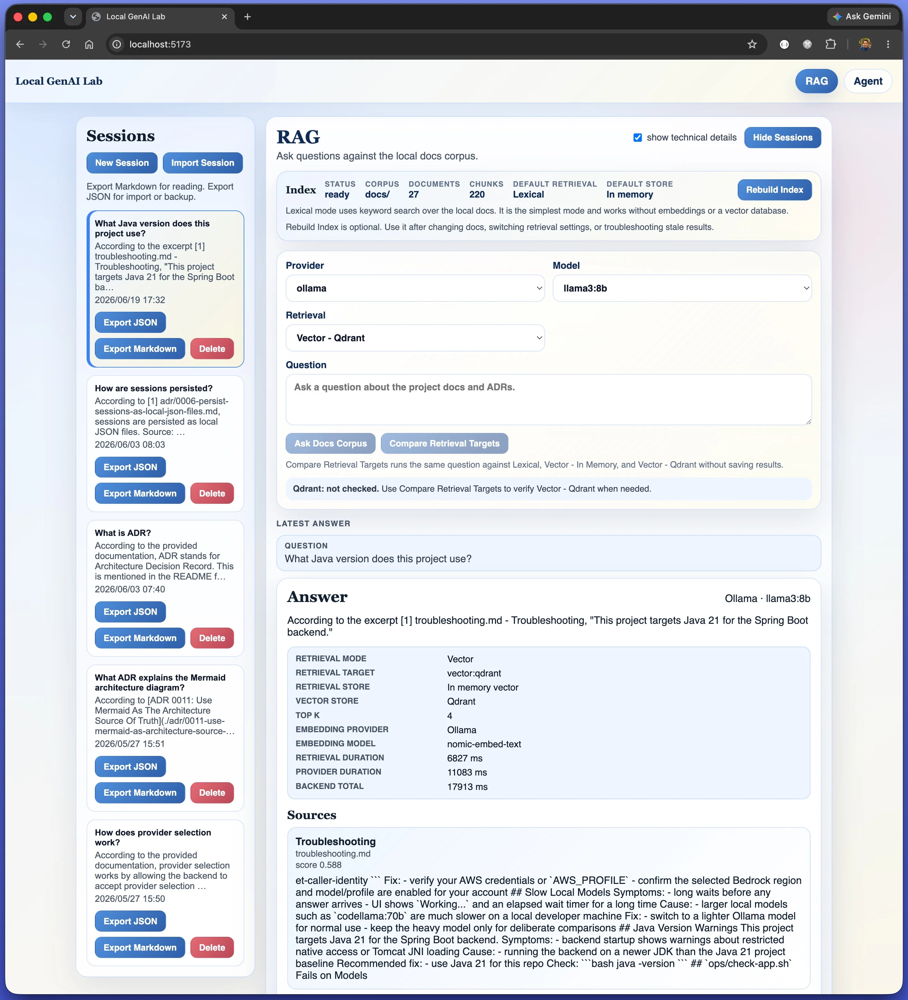

# Local GenAI Lab

[](https://github.com/jrodolfo/local-genai-lab/actions/workflows/ci.yml)


Local-first GenAI lab for building and testing tool-assisted chat workflows.
Not just a chatbot UI.

This project combines a React frontend, a Spring Boot orchestration backend, local and managed model providers, persistent session memory, MCP-backed AWS tooling, and an experimental RAG workspace over the project documentation in one full-stack repository.



## Fastest Path

If you want the shortest path to a running local setup:

```bash
cp .env.example .env
./start.sh
```

Then open:

- frontend: `http://localhost:5173`
- backend health: `http://localhost:8080/actuator/health`

Notes:

- By default, the backend starts on `http://localhost:8080` with `APP_MODEL_PROVIDER=ollama`.
- If you want Bedrock or Hugging Face available in the provider selector, add their config to `.env` first.
- For the default Ollama path, make sure `llama3:8b` is installed locally.
- The `RAG` workspace is enabled by default and uses the local `docs/` corpus.
- The lifecycle scripts store PID files and logs under `.run/`.
- Use `./status.sh` or `make status` to inspect the local runtime.

## Why This Matters

Most LLM demos stop at chat. This project explores how to connect models to real systems.

It focuses on:

- tool-assisted chat with backend-side orchestration instead of direct frontend-to-model calls
- provider abstraction with Ollama by default plus Amazon Bedrock and Hugging Face as optional runtimes
- persistent session memory with resume, search, filter, import, and export flows
- MCP-backed local tool execution for AWS audits, reports, and artifact generation
- a separate RAG workspace for asking questions against the local documentation corpus with cited source chunks
- structured report rendering, artifact preview, streaming responses, and API observability

## Architecture

High-level interaction flows:

For the full system-level view, see [docs/architecture.md](./docs/architecture.md).

```text
React -> Spring Boot
          |-> MCP -> Shell Scripts -> AWS CLI -> Report artifacts
          |-> Prompt enrichment with tool result -> Ollama / Bedrock
```

In the successful tool-assisted path, the backend:

1. receives the user message
2. decides a tool is needed
3. calls the MCP-backed tool
4. gets structured tool output back
5. builds an augmented prompt with that tool context
6. sends that enriched prompt to Ollama, Bedrock, or Hugging Face

Primary chat path:

```text
React Frontend -> Spring Boot Backend -> Ollama, Bedrock, or Hugging Face
```

Tool-assisted chat path:

```text
React Frontend -> Spring Boot Backend -> Local MCP Server -> Shell Scripts -> AWS CLI / report artifacts -> Spring Boot Backend prompt enrichment -> Ollama, Bedrock, or Hugging Face
```

RAG path:

```text
React RAG Workspace -> Spring Boot RAG API -> local docs corpus -> chunk retrieval -> Ollama, Bedrock, or Hugging Face -> answer with cited source chunks
```

Immediate backend response path:

```text
React Frontend -> Spring Boot Backend -> clarification or tool-failure response
```

## Project Structure

```text
local-genai-lab/
├── start.sh
├── stop.sh
├── restart.sh
├── status.sh
├── Makefile
├── ops/
│   ├── lib/
│   ├── tests/
│   └── README.md
├── backend/
│   ├── src/
│   ├── pom.xml
│   └── README.md
├── frontend/
│   ├── src/
│   ├── package.json
│   └── README.md
├── scripts/
│   ├── reports/
│   ├── tests/
│   ├── Makefile
│   └── README.md
├── mcp/
│   ├── src/
│   ├── package.json
│   └── README.md
├── docker-compose.yml
└── README.md
```

Script separation:

- top-level scripts and the root `Makefile` are the public local app lifecycle interface
- `ops/` contains internal local runtime helpers such as backend-only startup and stack smoke checks
- `scripts/` contains MCP/tool-facing shell scripts, report generators, and their shell tests

## Prerequisites

- Java 21+
- Maven 3.9+
- Node 20+
- Ollama installed locally for the default provider
- Docker + Docker Compose, optional
- AWS CLI v2 + `jq` + valid AWS credentials, only for AWS shell tools and local MCP-backed report flows

## Quick Start

### 1. Pull a local model

```bash
ollama pull llama3:8b
ollama run llama3:8b
```

Ollama should be reachable at `http://localhost:11434`.

### 2. Optional: create a local environment file

```bash
cp .env.example .env
```

Fill in only the providers you want available in the running backend process. The backend helper script will auto-load `.env` if it exists.

### 3. Start the app

```bash
./start.sh
```

This starts both:

- the Spring Boot backend
- the Vite frontend dev server

If you want Bedrock or Hugging Face as the default backend provider instead of Ollama, set `APP_MODEL_PROVIDER=bedrock` or `APP_MODEL_PROVIDER=huggingface` in `.env` or the shell before starting the app. Provider configuration details live in [docs/providers.md](./docs/providers.md).

If port `8080` is already in use, choose another backend port explicitly:

```bash
SERVER_PORT=8081 ./start.sh
```

The frontend dev proxy follows that override automatically when you start the app this way.

Backend URLs:

- API root: `http://localhost:8080`
- OpenAPI: `http://localhost:8080/v3/api-docs`
- Swagger UI: `http://localhost:8080/swagger-ui/index.html`
- Health: `http://localhost:8080/actuator/health`
- Info: `http://localhost:8080/actuator/info`

`GET /actuator` redirects to `/actuator/health`. Swagger excludes `/actuator/**` so the generated API docs stay focused on the application API.

### 4. Stop, restart, or inspect the app

```bash
./stop.sh
./restart.sh
./status.sh
```

The frontend provider and model selectors now load from the backend's `/api/models` endpoint. You can switch between supported providers at runtime without restarting the backend. For Ollama, the UI only offers locally installed models. If no local models are installed, the UI shows a clear pull hint instead of failing only after submit.

The provider selector only shows providers configured in the running backend process. The provider status banner is cached briefly to avoid excessive live checks, shows `Last checked`, and includes a manual `Refresh status` action when you want to re-fetch the current status explicitly.

For tool-assisted streaming chat, the UI now shows explicit tool lifecycle phases while the request is in flight. Completed assistant replies also show compact tool provenance, and generated summaries, reports, and file lists can be inspected through the artifact inspector panel.

The separate `RAG` workspace is enabled by default. In phase 1, it queries a fixed local corpus rooted at `docs/` and returns answers with cited source chunks. If you want to hide it, start the backend with `RAG_ENABLED=false`.

Good first RAG test prompts:

- `How does provider selection work?`
- `Why is MCP separate from the backend?`
- `How are sessions persisted?`
- `What ADR explains the Mermaid architecture diagram?`

### 5. Optional: build the local MCP server

```bash
cd mcp
npm install
npm run build
```

MCP is enabled by default in the backend. To run without it, set `MCP_ENABLED=false`.

## Docker

Keep Ollama running on the host first, then:

```bash
docker compose up --build
```

- frontend: `http://localhost:3000`
- backend: `http://localhost:8080`

## Configuration Overview

The most important backend settings are:

- `APP_MODEL_PROVIDER` default: `ollama`
- `OLLAMA_DEFAULT_MODEL` default: `llama3:8b`
- `BEDROCK_REGION` default: `us-east-2`
- `BEDROCK_MODEL_ID` default: empty
- `HUGGINGFACE_BASE_URL` default: `https://router.huggingface.co/v1/chat/completions`
- `HUGGINGFACE_DEFAULT_MODEL` default: empty
- `HUGGINGFACE_MODELS` default: empty
- `MCP_ENABLED` default: `true`
- `RAG_ENABLED` default: `true`
- `RAG_CORPUS_ROOT` default: `docs`
- `RAG_TOP_K` default: `4`
- `APP_TOOLS_ROUTING_MODE` default: `hybrid`
- `APP_STORAGE_SESSIONS_DIRECTORY` default: `data/sessions`
- `APP_STORAGE_REPORTS_DIRECTORY` default: `scripts/reports`

The storage defaults are resolved from the project root so they stay stable whether the backend starts from `backend/` or the repository root.
You can also point `APP_STORAGE_REPORTS_DIRECTORY` to an absolute path outside the repository if you want report artifacts stored elsewhere.
Provider switching details and helper startup scripts live in [docs/providers.md](./docs/providers.md).

## Main Features

### Chat and Providers

- normal and streaming chat endpoints
- Ollama as the default provider
- Amazon Bedrock as an optional provider
- Hugging Face as an optional hosted provider with a configured candidate list that the backend validates dynamically
- provider metadata in responses and saved session history
- typed JSON SSE events for streaming chat
- provider-aware model discovery for the frontend selector
- runtime provider switching across providers configured in the current backend process

Observed model behavior:

- successful tool execution still flows through the selected model by design
- the backend enriches the prompt with grounded tool output instead of bypassing the model
- different models may still phrase the final answer differently after receiving the same tool context
- that variance is intentional in this lab because it helps compare model behavior under grounded prompts

### Sessions

- local JSON-backed conversation memory
- generated session titles and summaries
- session sidebar with search and filters
- JSON and Markdown export
- JSON import with collision-safe session ids
- backend-managed opaque session ids with strict validation
- separate chat and RAG session modes so RAG answers and citations can be reopened without rerunning retrieval

### RAG Workspace

- enabled by default with `RAG_ENABLED=true`
- isolated from the normal chat, MCP, and tool-routing flow
- fixed phase-1 corpus rooted at `docs/`
- in-memory lexical retrieval behind a replaceable backend abstraction
- lexical retrieval is intentional as a zero-dependency baseline; see [docs/rag-evaluation-guide.md](./docs/rag-evaluation-guide.md) for the lexical vs vector comparison
- the RAG status card reports both retrieval mode (`Lexical`) and store (`In-memory`)
- answers generated by the selected provider and returned with cited source chunks
- RAG conversations persist as local JSON sessions with saved answers and citations
- no uploads, external vector database, or agent routing in phase 1

### Tools and Artifacts

- local MCP-backed AWS audit and reporting flows
- LLM-assisted tool routing with fallback
- multi-turn clarification for missing tool inputs
- structured report cards in the UI
- read-only artifact preview and file listing under `scripts/reports/`

Artifact API note:

- the configured reports directory may be inside or outside the repository
- artifact endpoints accept only paths relative to that configured reports directory
- absolute artifact paths are rejected intentionally so the backend keeps a strict read-only boundary

## Shell Scripts

The shell tooling lives under [`scripts/`](./scripts). Useful entrypoints:

```bash
make help
make check-app
cd scripts
make help
make test
make audit
make s3-cloudwatch BUCKET=example.com
```

`make check-app` verifies backend health, backend model discovery, frontend reachability, and optional Ollama availability with sensible local defaults.

## Documentation Map

- [docs/architecture.md](./docs/architecture.md): system overview, request flows, provider architecture, tool orchestration, storage, and design decisions
- [docs/rag-evaluation-guide.md](./docs/rag-evaluation-guide.md): manual evaluation guide for the phase-1 RAG workspace
- [docs/architecture-walkthrough.md](./docs/architecture-walkthrough.md): concise walkthrough of the system design, tradeoffs, and common design questions
- [docs/adr/](./docs/adr/): accepted architecture decision records
- [docs/testing.md](./docs/testing.md): automated suites, manual smoke tests, and current non-automated areas
- [docs/troubleshooting.md](./docs/troubleshooting.md): common local runtime problems and practical fixes
- [backend/README.md](./backend/README.md): backend API, provider config, MCP integration, Actuator, sessions, Bedrock notes
- [frontend/README.md](./frontend/README.md): frontend-specific details
- [ops/README.md](./ops/README.md): local runtime helpers and lifecycle support files
- [scripts/README.md](./scripts/README.md): shell tooling, report formats, smoke checks
- [mcp/README.md](./mcp/README.md): local MCP server details
- [docs/providers.md](./docs/providers.md): switching between Ollama and Bedrock

## Current Scope

- single-user, local-first GenAI lab for hands-on learning and AWS Generative AI Developer Professional exam preparation
- optimized for correctness, inspectability, and local workflow clarity rather than multi-user scale
- intended to run on a developer machine with local Ollama, optional Bedrock access, and optional MCP-backed AWS tooling

## Known Limitations

- not designed as a multi-tenant or internet-facing production service
- MCP tool execution currently uses short-lived local subprocesses, which is acceptable for this local lab but not tuned for shared high-concurrency use
- backend health/readiness is backend-only; whole-stack local checks belong to `ops/check-app.sh`
- artifact access is intentionally read-only and bounded to the configured reports directory
- Bedrock and AWS tool flows depend on your local AWS credentials and runtime environment being configured correctly
- some operational choices favor simple local behavior over production-style resilience, especially around local process orchestration and developer-machine assumptions

## Notes for Heavier Models

- `codellama:70b` is optional and not the recommended first-run default
- larger local models can be much slower and more memory intensive
- if you use a heavier model, you may need to raise backend read timeouts

## Contact

- Software Developer: Rod Oliveira
- GitHub: https://github.com/jrodolfo
- Webpage: https://jrodolfo.net

## License

- MIT License
- Copyright (c) 2026 Rod Oliveira
- See [LICENSE](./LICENSE)
