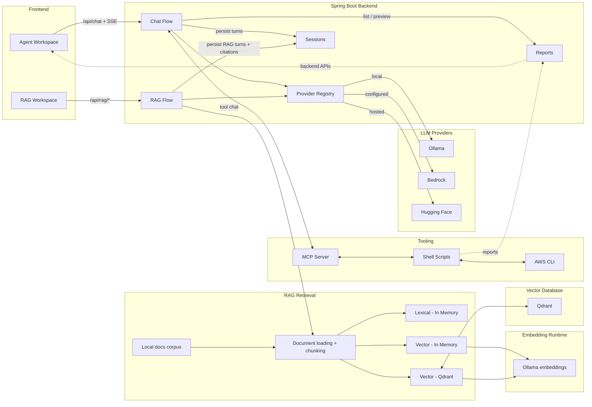

# Architecture Overview

This Mermaid diagram is the maintained source of truth for the system architecture. Mermaid diagrams are easier to maintain in Git, review in diffs, and update when the architecture changes. Please update this document whenever architectural changes are introduced.

The diagram below captures the current architecture in a compact, maintainable form:

- `Agent Workspace` covers chat, tool-assisted prompts, sessions, exports, and artifact access.
- `RAG Workspace` covers local-docs questions, retrieval target selection, cited answers, RAG sessions, and retrieval comparison.
- `Chat Flow` covers agent routing, prompt construction, streaming, tool use, and persistence.
- `RAG Flow` covers `/api/rag/*`, docs loading, chunk retrieval, answer generation, citations, and RAG session persistence.
- `Provider Registry` covers runtime provider selection, configured-provider filtering, and provider status/troubleshooting.
- `RAG Retrieval` shows the three implemented retrieval targets: lexical in memory, vector in memory, and vector in Qdrant.
- `Reports` covers generated summaries, report files, stderr files, and backend-driven previews.

The Agent and RAG workspaces deliberately share provider/model selection and session storage, but they do not share request orchestration. Agent requests use `/api/chat` and may invoke MCP tools. RAG requests use `/api/rag/*`, query the local documentation corpus, and do not invoke MCP tools.

Related detail:

- [architecture.md](./architecture.md)
- [ADR 0012: Add Isolated Phase-1 RAG Workspace Over Local Docs Corpus](./adr/0012-add-isolated-phase-1-rag-workspace-over-local-docs-corpus.md)
- [ADR 0013: Use Ollama Embeddings And Qdrant For Phase-2 RAG Vector Retrieval](./adr/0013-use-ollama-embeddings-and-qdrant-for-phase-2-rag-vector-retrieval.md)
- [RAG Phase 2 Vector Retrieval Design](./rag-phase-2-vector-retrieval-design.md)
- [Qdrant Inspection Guide](./rag-qdrant-inspection.md)
