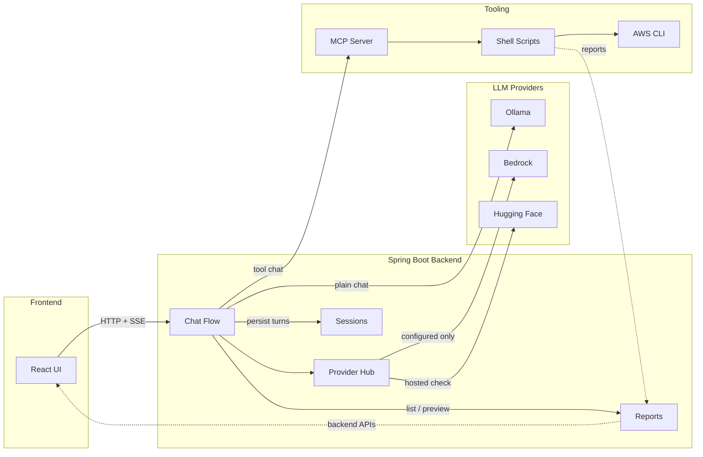

# Architecture Overview

This Mermaid version replaces the generated SVG because it is easier to maintain in Git, review in diffs, and update when the architecture changes.

The diagram keeps the same architectural meaning as the previous SVG:

- `React UI` covers chat, sessions, provider/model selection, exports, and artifact access.
- `Chat Flow` covers routing, prompt construction, streaming, and persistence.
- `Provider Hub` covers runtime provider selection, configured-provider filtering, and provider status/troubleshooting.
- `Reports` covers generated summaries, report files, stderr files, and backend-driven previews.

