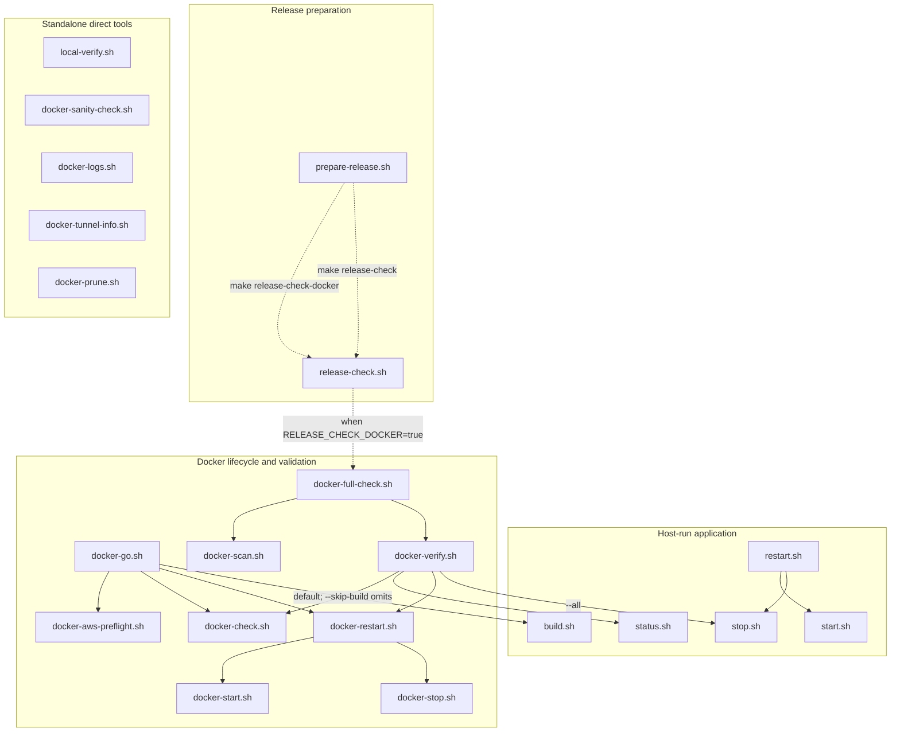

# Scripts

Human-facing lifecycle and Docker commands for running Local GenAI Lab from the
repository root.

This directory owns commands that a developer runs directly to start, stop,
inspect, build, or validate the app. The root `Makefile` calls these scripts so
`make start` and `./scripts/start.sh` stay aligned.

## Script Relationships

This diagram shows execution relationships between human-facing scripts. A
solid arrow means the source script invokes the destination script. A dashed
arrow means the relationship goes through a `make` target. Standalone helper
scripts are shown without arrows because they are run directly when needed.



Update this diagram whenever a human-facing script begins invoking another
human-facing script or stops doing so. It intentionally omits shared shell
libraries under `ops/` and commands merely suggested in output text.

## Commands

Host-run app lifecycle:

```bash
./scripts/start.sh
./scripts/stop.sh
./scripts/restart.sh
./scripts/status.sh
./scripts/build.sh
./scripts/local-verify.sh
```

`local-verify.sh` is the human-facing local verification wrapper for Linux or
EC2 development hosts. It prints the detected Java, Maven, Node, npm, and make
versions, then runs either:

- `--quick`: backend tests, frontend tests, and frontend build
- `--full` or default: `make verify`

Each step writes its full output to `/tmp/local-genai-lab-*.txt`, which makes
remote troubleshooting easier than relying on terminal scrollback alone.

Docker lifecycle:

```bash
./scripts/docker-sanity-check.sh
./scripts/docker-start.sh
./scripts/docker-stop.sh
./scripts/docker-restart.sh
./scripts/docker-status.sh
./scripts/docker-logs.sh
./scripts/docker-tunnel-info.sh
./scripts/docker-check.sh
./scripts/docker-aws-preflight.sh
./scripts/docker-go.sh
./scripts/docker-verify.sh
./scripts/docker-scan.sh
./scripts/docker-full-check.sh
./scripts/release-check.sh
```

Docker-based AWS Agent tools are opt-in because they mount host AWS
configuration into the backend container. To enable them for your machine
without passing flags to every Docker command:

```bash
cp .env.docker-aws-tools.example .env.docker-aws-tools
```

Then edit `AWS_PROFILE`, `AWS_REGION`, and `LOCAL_GENAI_LAB_AWS_DIR` if needed.
The file is ignored by Git. When enabled, `docker-start.sh` and
`docker-restart.sh` use the AWS compose override automatically during startup.

`docker-sanity-check.sh` is the fastest Docker preflight. It verifies that the
Docker daemon and Compose plugin are reachable before you spend time on image
builds, Compose startup, or Trivy scans. To also prove Docker can run a
container, use:

```bash
DOCKER_SANITY_RUN_HELLO_WORLD=true ./scripts/docker-sanity-check.sh
```

`docker-aws-preflight.sh` verifies the opt-in AWS configuration used by Agent
tools. It checks the host AWS directory, its read-only mount in `llm-backend`,
the in-container `aws` and `jq` commands, and `aws sts get-caller-identity`.
It reports the active AWS account and ARN, but never credential values. Run it
after Docker startup and before AWS Agent testing:

```bash
./scripts/docker-aws-preflight.sh
```

`docker-go.sh` is the standard Docker preparation workflow for AWS Agent testing.
It runs `build.sh`, `docker-restart.sh`, `docker-check.sh`, and
`docker-aws-preflight.sh` in that order, stopping at the first failure. To
restart and validate the existing image without a local rebuild, use:

```bash
./scripts/docker-go.sh --skip-build
```

The script works on macOS and Linux where Bash and Docker Compose are available.
On Windows 11, use WSL or Git Bash. For local Docker testing, use
`http://localhost:3000`. Set `DOCKER_GO_TUNNEL_HOST=my-ec2-1` when Docker runs
on a remote host to print tunnel guidance for `http://localhost:3001`. The
script always prints browser cache advice.

`docker-scan.sh` and `docker-full-check.sh` require Trivy on `PATH`. On Amazon
Linux EC2 hosts, one working install pattern is:

```bash
sudo rpm -ivh https://github.com/aquasecurity/trivy/releases/latest/download/trivy_0.66.0_Linux-64bit.rpm
trivy --version
```

If Trivy is missing, `docker-full-check.sh` still reports whether functional
Docker verification passed before failing the image-scan step.

`docker-start.sh` prints the runtime URLs, log commands, smoke-check commands,
and Docker Desktop paths after the stack starts. Use `docker-logs.sh` to follow
logs without remembering Compose service names:

```bash
./scripts/docker-logs.sh
./scripts/docker-logs.sh backend
./scripts/docker-logs.sh frontend
./scripts/docker-logs.sh qdrant
```

When the Docker stack runs on a remote machine, such as an EC2 instance,
`docker-tunnel-info.sh` prints copy-paste SSH tunnel commands and the local Mac
URLs to open:

```bash
./scripts/docker-tunnel-info.sh my-ec2-1
./scripts/docker-tunnel-info.sh --include-qdrant my-ec2-1
```

On Linux Docker hosts, the backend container reaches host-run Ollama through
`host.docker.internal`, which is mapped to Docker's host gateway by
`docker-compose.yml`. Keep `DOCKER_OLLAMA_BASE_URL` as
`http://host.docker.internal:11434` unless your host exposes Ollama somewhere
else. If the backend can resolve `host.docker.internal` but cannot connect,
configure the host Ollama service to listen on `0.0.0.0:11434`; do not expose
port `11434` in the EC2 security group or other Internet-facing firewall.

Release validation:

```bash
./scripts/release-check.sh
RELEASE_CHECK_DOCKER=true ./scripts/release-check.sh
./scripts/prepare-release.sh v0.2.0
make prepare-release VERSION=v0.2.0
```

The default release check runs tests, broader verification, dependency freshness
reporting, and whitespace checks. Docker verification and image scanning are
opt-in with `RELEASE_CHECK_DOCKER=true` or `make release-check-docker` so the
default release gate can still run when Docker Desktop, Docker Engine, or Trivy
is unavailable.
When Docker is requested, the script preflights Docker, Docker Compose, and
Trivy before running expensive tests.

`prepare-release.sh` is a guided release-preparation wrapper. It prints and runs
the local release commands, writes long output to versioned files under `/tmp`,
and then prints the GitHub Release fields and post-publish tag sync commands.
It requires a version argument because that version is used in the `/tmp` file
names and release reminder text. It does not create tags or publish a GitHub
Release. `make release-check-docker` is a lower-level validation target and does
not require a version.

## Folder Boundaries

- `scripts/`: human-facing lifecycle, build, and Docker commands.
- `ops/`: support libraries, local smoke checks, and shell tests behind the lifecycle commands.
- `agents/`: MCP/agent tool scripts, dependency freshness reporting, and generated report artifacts.

Root-level shell scripts are intentionally not allowed. `make test-ops` includes
a layout guardrail that fails if a `*.sh` file appears in the repository root.
